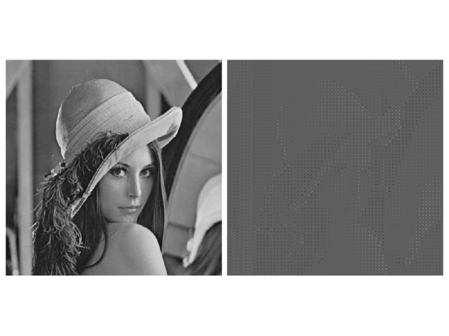
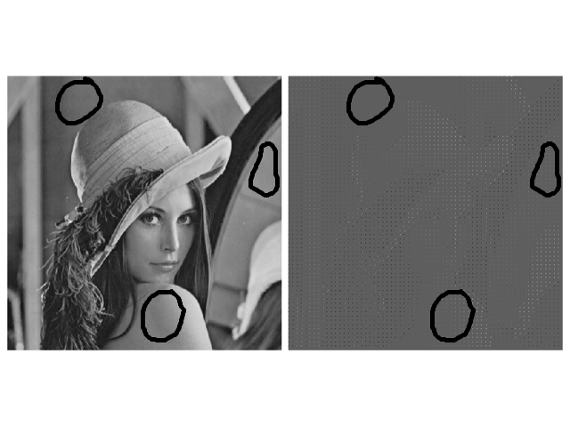
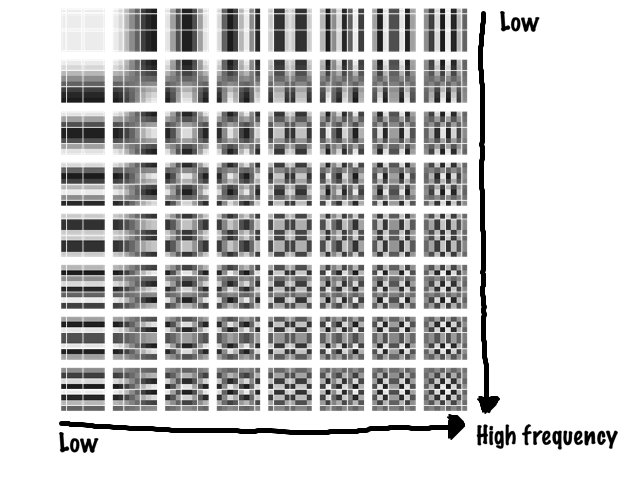
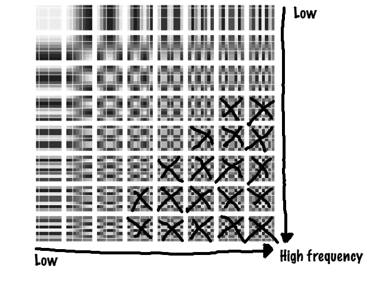
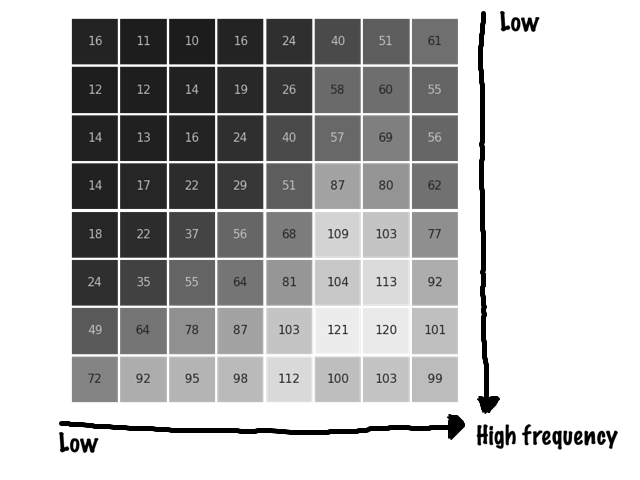
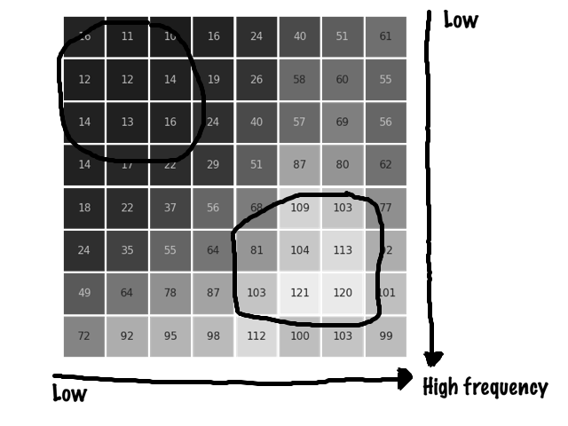
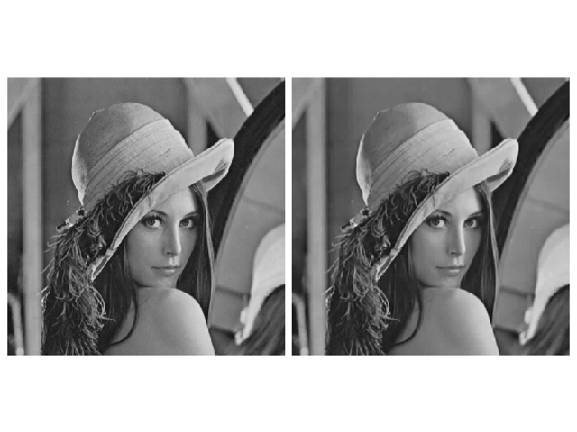
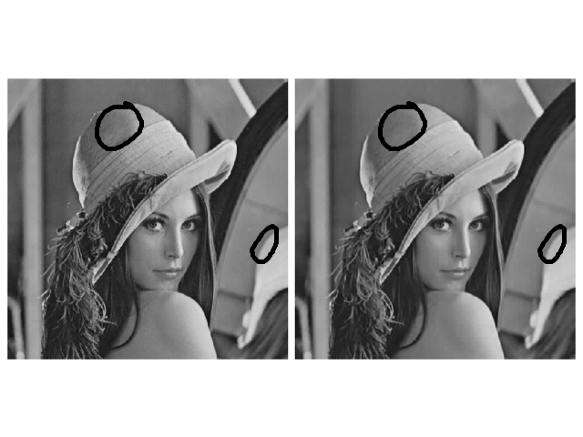

slidenumbers: true
footer: Implementing JPEG in Python | Open Source Day, GoDataFest 2019, Cor Zuurmond | github.com/JCZuurmond/pyjpeg

# Implementing 
# [fit] JPEG 
# in Python

---

# Meet Lena


---

# She is a data consultant


---

## Lena dreamt of going back in time


---

# She would be a data queen[^0]


[^0]: Crown by Marco Livolsi from the Noun Project

---

# Just another day 


---

# New client


---

# Something special happened


---

# Lena did not notice it at first


^ 
Sure people look old and fancy
She walked to the meeting room and told everybody the
data consultant was here!

---

# The data consultant is here!


---

# Peet was skeptical

 

[.header: alignment(right)]

---

## His company invested a lot of money in digital photo cameras


 

[.header: alignment(right)]

---

# [fit] Can you help us?

---

# Did you compress your images?


---

# Compress?

 

[.header: alignment(right)]

---

# Yes, compress!

 

---

# [fit] .zip 
# [fit] .tar
# [fit] .gz
# [fit] deflate

---

# Compress!

 

---

# No... Can you do it?

 

[.header: alignment(right)]

---

# Uhm, sure!

 

---

## As always, Lena started with Google

---

# but Google did not work.

---

# Lena found out she time traveled


---

# After a 
# [fit] mental breakdown 
# of a couple hours

---

# How does image compression work?

---

# She thought hard <br> and hard

---

## The next day she presented her findings


----

# Original image


----

# Original image


---

# Number of bits

$$N_{\textit{pixels}} = W * H * C$$
<br>
$$N_{\textit{bits}} = N_{\textit{pixels}} * \textit{pixels per bit}$$

$$W$$ = width
$$H$$ = height
$$C$$ = channels

---

# Pixel values


---

# Bits per pixel


---

## Number of bits
<br>
# $$ N_{\textit{bits}} = 8 * W * H $$

---

# Reduce image size with 37.5%!


---

# Compressed image I 


---

# Reduce image size with 50%!!


---

# Compressed image II


---

# Reduce image size by 75%!!!

---

# Compressed image III


---

## I am a little disappointed

 

^
To put it softly

[.header: alignment(right)]

---

## Can I have a second chance?

 

---

# Lena needed a drink


^
After sitting in the bar for a couple hours staring blank to the wall.

---

## Lena was not the data queen she thought she would be[^0]


---

# She was standing <br> on the <br> shoulders of giants

---

## Mr Huffman walked into the bar


^ 
Why the long face?
Lena told about the compression. Mr Huffman did not know anything about image
compression. But she knew about the war.

---

# He started talking about the war

---

## He told about Morse code


^
She sent messages about the weather. And that they had special codes for the
common weather types. Also they thought off a code to get more cigarettes and
beer.

---

## More frequently occurring characters get shorter codes


---

# What if more frequently occurring pixel values use less bits?

---

# This might work!


---

# Though...

- Probably other pictures have a different distribution in pixel values;

---

# Though...

- Probably other pictures have a different distribution in pixel values;
- Storing the mapping (every time) takes memory;

---

# Though...

- Probably other pictures have a different distribution in pixel values;
- Storing the mapping (every time) takes memory;
- We do not know the distribution of pixel values of all images;

---

# Though...

- Probably other pictures have a different distribution in pixel values;
- Storing the mapping (every time) takes memory;
- We do not know the distribution of pixel values of all images;
- The distribution might be mostly flat - equally distributed.

---

## Lena felt she was on the right track


---

# What do all pictures have in common?

---

# Let's look at the image again


---

# Neighbouring pixels


---

# Most pixels have similar values as their neighbouring pixels

---

# Lena got in the flow

1. If pixels are correlated to neighbouring pixels,

---

# Lena got in the flow

1. If pixels are correlated to neighbouring pixels,
   the change in values of neighbouring pixels is low.

---

# Lena got in the flow

1. If pixels are correlated to neighbouring pixels,
   the change in values of neighbouring pixels is low.
2. If we decompose pictures into frequencies,

---

# Lena got in the flow

1. If pixels are correlated to neighbouring pixels,
   the change in values of neighbouring pixels is low.
2. If we decompose pictures into frequencies,
   we expect mostly low frequencies, and few high frequencies.

---

# Lena got in the flow

1. If pixels are correlated to neighbouring pixels,
   the change in values of neighbouring pixels is low.
2. If we decompose pictures into frequencies,
   we expect mostly low frequencies, and few high frequencies.
3. The factor of high frequencies is low - probably zero.

---

# Lena got in the flow

1. If pixels are correlated to neighbouring pixels,
   the change in values of neighbouring pixels is low.
2. If we decompose pictures into frequencies,
   we expect mostly low frequencies, and few high frequencies.
3. The factor of high frequencies is low - probably zero.
4. We can compress many zeros!

---

# How to get pixel value frequencies?

---

# Convolution?
# Filters?

---

# Filters

---

# Filters extract certain frequencies

---

# Cookiecutter


^
The shape - filter - you have determines what you get out.

---

# Filter that resembles a wave


---

# A filter for each frequency


---

# Another frequency


---

# Another frequency


---

# But, for pictures/pixels

<br> <br>


---

# Another frequency

<br> <br>


---

# Another frequency

<br> <br>


---

# Another frequency

<br> <br>


---

# Filter for zero frequency

<br> <br>


---

# Two-dimensional filter


---

# Changing horizontal frequency


---

# Changing horizontal frequency


---

# Changing horizontal frequency


---

# Changing horizontal frequency


---

# Changing vertical frequency


---

# Changing vertical frequency


---

# Changing vertical frequency


---

# Changing vertical frequency


---

# Changing both frequencies


---

# Changing both frequencies


---

# Changing both frequencies


---

# Or


---

# Or


---

# High frequency


--- 

# Convolution

---

# A convolution applies a filter to a group of <br> neighbouring pixels

---

# It loops over groups of pixels[^1]


[^1]: https://zhenye-na.github.io/2018/11/30/cnn-deep-leearning-ai-week1.html

---

# An example[^2]


[^2]: https://towardsdatascience.com/applied-deep-learning-part-4-convolutional-neural-networks-584bc134c1e2

---

# An example[^2]


^ https://towardsdatascience.com/applied-deep-learning-part-4-convolutional-neural-networks-584bc134c1e2

---

# All together

<br>

```
for each filter:
	for each group of pixels:
		apply filter to the group of pixels
```

---

# This is what Lena did!


---

# Original image


---

# Image after applying the filters


---

# Side by side



---

# Side by side



---

# Most values were around zero!


---

# If many values <br> are zero we can <br> compress them!

---

## We can get more zeros by removing high frequencies

---

# Remember the filters?


---

# Remember the filters?


---

# Remember the filters?


---

# Remember the filters?


---

# Remember the filters?


---

# Remember the filters?


---

# Remember the filters?


---

# Remember the filters?


---

# Remember the filters?


---

# Remember the filters?


---

# Remember the filters?


---


--- 



---



---

# Reduce higher frequencies with a bigger factor

---

# Reduce matrix

 

---

# Reduce matrix

 

---

# Lena put it all together

---

# Original image


---

# Compressed image


---

# Side by side



---

# Side by side



---

# With a reduction of 85%!!!!!

---

## Peet was very happy!


---

## Lena was a data queen after all!!![^0]


---

# Open Source <br> makes life easier

---

# Implementing 
# [fit] JPEG 
# in Python

---

# Code is on Github

# [fit] github.com/JCZuurmond/pyjpeg
