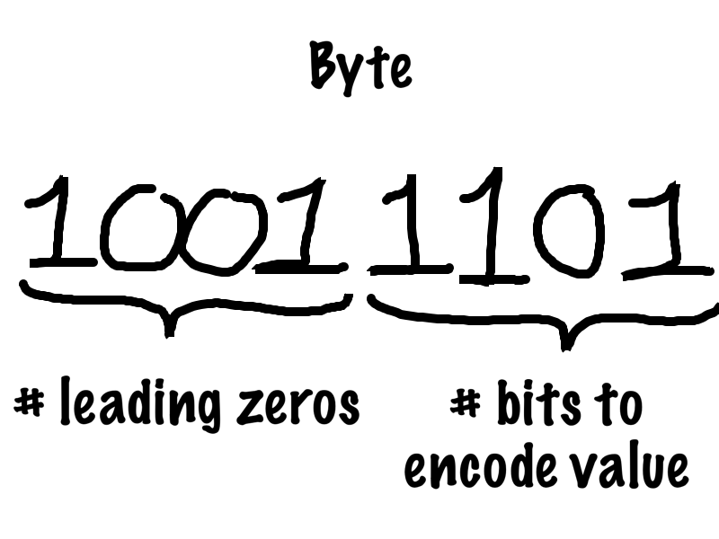

slidenumbers: true
footer: PyData Meetup 26-02-20, Image compression

# Efficiently store your images

----

# Today we own a webshop

----

# Webshop

- Not a small one, but one of similar size as Alibaba or Amazon;

----

# Webshop

- Not a small one, but one of similar size as Alibaba or Amazon;
- People upload thousands of photos every day;
	- They need to be stored;
	- Send to people who request them;

---

# A lot of data (movement)   is involved with these images

---

# We are responsible for handling this efficiently

---

# We are responsible for handling this efficiently
## A.k.a. save money 

---

## Let's discuss some obvious examples

^ Some duplicates might be needed to avoid data loss and have short response
time across the globe

---

## Unnecessary duplicates can be removed!

---

# Only relevant images are kept

---

## The question is:  What is useful information?

- Not useful are:
	- unnecessary duplicate values;
	- "meaningless" signals;

---

## Besides removing pictures as a whole, can we discard information within a picture?

---

# Can we compress images?

---

# How (not) to compress images

----

# Image dimensions

---

# Number of bits

$$N_{\textit{pixels}} = W \cdot H \cdot C$$
 
$$N_{\textit{bits}} = N_{\textit{pixels}} \cdot \textit{pixels per bit}$$

$$W$$ = width
$$H$$ = height
$$C$$ = channels

---

# Pixel values

---

# Bits per pixel

---

## Number of bits
 
# $$ N_{\textit{bits}} = 8 * W * H $$
 
**Assuming grey pictures (1 channel)**

---

# Reduce image size with 37.5%!

---

# Compressed image I 

---

# Reduce image size with 50%!!

---

# Compressed image II

---

# Reduce image size by 75%!!!

---

# Compressed image III

---

# So, how should we compress images?

---

---

---

---

---

---

# So, how to compress images?

- maybe we can do something with:
	- duplicate values;
	- "meaningless" signals;

---

# "Duplicate" values

---

# Images are autocorrelated

---

# Downsampling 
## 6% of original image size

---

# Downsampling
## 1.5% of original image size

---

# Can we extract these autocorrelated signals?

---

# Maybe with frequencies!

---

# Discrete cosine transform

---

# Convolution[^1]

[^1]: https://zhenye-na.github.io/2018/11/30/cnn-deep-leearning-ai-week1.html

---

# An example[^2]

[^2]: https://towardsdatascience.com/applied-deep-learning-part-4-convolutional-neural-networks-584bc134c1e2

---

# An example[^2]

^ https://towardsdatascience.com/applied-deep-learning-part-4-convolutional-neural-networks-584bc134c1e2

---

# Filter that resembles a wave

---

# A filter for each frequency

---

# Another frequency

---

# Another frequency

---

# But, for pictures/pixels

   

---

# Another frequency

   

---

# Another frequency

   

---

# Another frequency

   

---

# Filter for zero frequency

   

---

# Two-dimensional filter

---

# Changing horizontal frequency

---

# Changing horizontal frequency

---

# Changing horizontal frequency

---

# Changing horizontal frequency

---

# Changing vertical frequency

---

# Changing vertical frequency

---

# Changing vertical frequency

---

# Changing vertical frequency

---

# Changing both frequencies

---

# Changing both frequencies

---

# Changing both frequencies

---

# Or

---

# Or

---

# High frequency

---

# Frequency values

---

## Here we see more duplicates! 
### There are many zeros

---

# We can use this in our encoding

--- 

---

# So, how to compress images?

- maybe we can do something with:
	- ~~duplicate values;~~
	- "meaningless" signals;

---

# Remember the filters?

---

--- 

---

---

# Remove higher frequencies

---

# Reduce matrix

 

---

# Reduce matrix

 

---

# Skip the implementation of the reverse logic

---

# Compressed image

---

# Side by side

---

# Side by side

--- 

# With a reduction of 85%!!!
