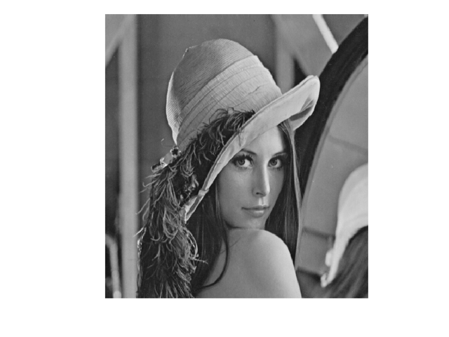
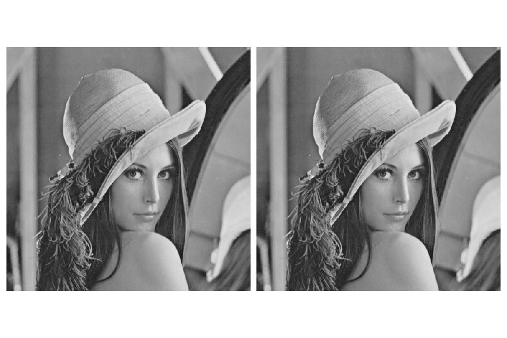
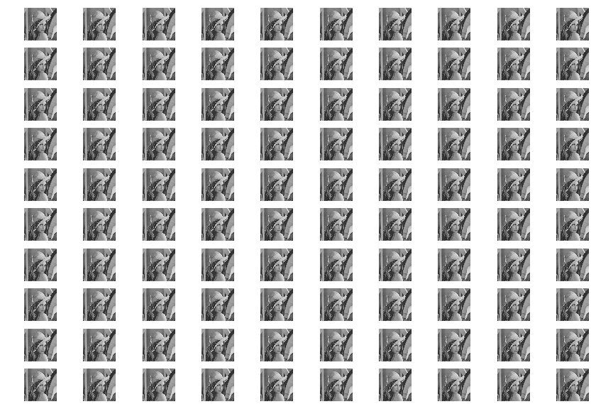
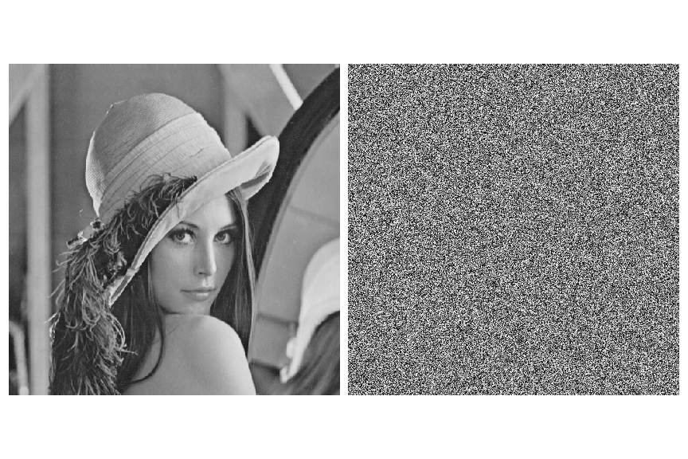
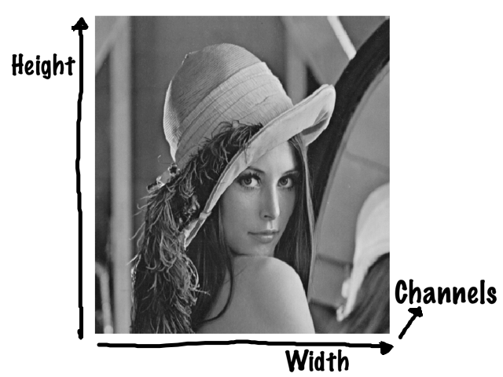
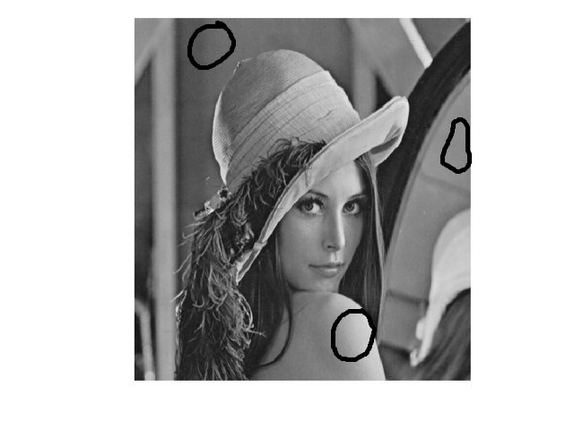

slidenumbers: true
footer: PyData Meetup 26-02-20, Image compression

# Image compression
# in Python

----

# Learn how to compress the following image

---

# Before we start coding

---

# Let's discuss quantities of data

- Big data;
- Small data;
- Huge data;
- Tiny data;
- Enormous data;

---

# Let's discuss quantities of data

- Big data;
- Small data;
- Huge data;
- Tiny data;
- Enormous data;

----

# You want big data?

---

# Big data you will get

---

# When do we have "more" data?

---

# When do we have "more" data?

- Not just more samples

---

# When do we have "more" data?

- Not just more samples;
- The samples should be different from each other;

---

# But, this is not useful either

---

# When do we have "more" data?

- Not just more samples;
- ~~The samples should be different from each other;~~
- The samples should contain different "information";

---

# But, this is not useful either

---

# When do we have "more" data?

- Not just more samples;
- ~~The samples should be different from each other;~~
- ~~The samples should contain different "information";~~
- The samples should contain different "useful information";

---

# Useful information

- Different meaning for:
	- Different types of data;
	- Different uses for the data;

---

# Useful information

- Different meaning for:
	- **Different types of data;**
	- Different uses for the data;

---

# Images

----

# Image dimensions

---

# Number of bits

$$N_{\textit{pixels}} = W \cdot H \cdot C$$
 
$$N_{\textit{bits}} = N_{\textit{pixels}} \cdot \textit{pixels per bit}$$

$$W$$ = width
$$H$$ = height
$$C$$ = channels

---

# Pixel values

---

# Bits per pixel

---

## Number of bits
 
# $$ N_{\textit{bits}} = 8 * W * H $$
 
**Assuming grey pictures (1 channel)**

---

# Reduce image size with 37.5%!

---

# Compressed image I 

---

# Reduce image size with 50%!!

---

# Compressed image II

---

# Reduce image size by 75%!!!

---

# Compressed image III

---

# What is   "useful information" within images?

---

# Images are autocorrelated data

---

# We need to go to the frequency domain!

---

# Discrete cosine transform

---

# Filter that resembles a wave

---

# A filter for each frequency

---

# Another frequency

---

# Another frequency

---

# But, for pictures/pixels

   

---

# Another frequency

   

---

# Another frequency

   

---

# Another frequency

   

---

# Filter for zero frequency

   

---

# Two-dimensional filter

---

# Changing horizontal frequency

---

# Changing horizontal frequency

---

# Changing horizontal frequency

---

# Changing horizontal frequency

---

# Changing vertical frequency

---

# Changing vertical frequency

---

# Changing vertical frequency

---

# Changing vertical frequency

---

# Changing both frequencies

---

# Changing both frequencies

---

# Changing both frequencies

---

# Or

---

# Or

---

# High frequency

---

# Convolution[^1]

[^1]: https://zhenye-na.github.io/2018/11/30/cnn-deep-leearning-ai-week1.html

---

# An example[^2]

[^2]: https://towardsdatascience.com/applied-deep-learning-part-4-convolutional-neural-networks-584bc134c1e2

---

# An example[^2]

^ https://towardsdatascience.com/applied-deep-learning-part-4-convolutional-neural-networks-584bc134c1e2

